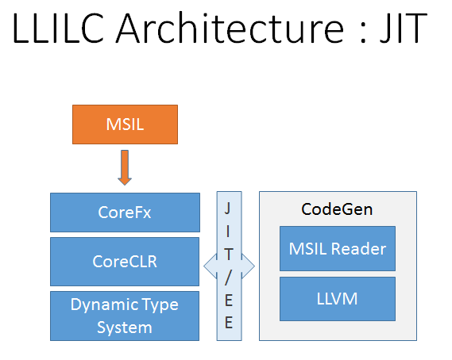
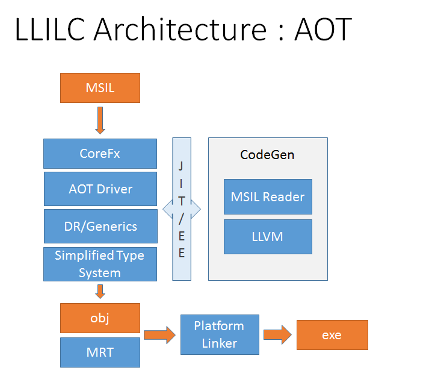

#LLILC Architecture Overview

##Introduction

LLILC is a code generator based on LLVM for MSIL (C#).  The intent of the architecture is to allow 
compilation of MSIL using industrial stregth components from a C++ compliler.  LLVM gives us the 
infrastructure to do this but additions are required to bring managed code semantics to LLVM. The 
LLILC architecture is split broadly into three logical components.  First, high level MSIL transforms, 
that expand out high level semantics in to more MSIL, second, high level type optimizations that removes 
unneeded types from the program, and third translation to LLVM bitcode and code generation.   

Since we're in the early days of the project we've taken the third item first.  Today we're building 
a JIT to allow us to validate the MSIL translation to bitcode as well as build muscle on LLVM.  This 
will be followed by work on the required high level transforms, like method delegates, and generics, 
to get the basics working for AOT, and lastly the type based optimizations to improve code size and 
code quality.

The rest of the document outlines architecture but leaves some elements minimally defined since these 
areas still need to be fully fleshed out.

## Architectural Components

The following are the main componets of the system.  In the case of CoreCLR and LLVM, these components 
are provided by other projects/repositories and provide their own documentation.  Other's, like the MSIL 
reader, are provided by this documented by LLILC.

####CoreCLR

The CoreCLR is the open source dynamic execution environment for MSIL (C#) it provides a dynamic type system, 
a code manager that organizes compilation, and an execution engine (EE).  Additionally the runtime provides the 
helpers, type tests, memory barries, required by the code generator for compilation.  The LLILC JIT takes a 
dependency on a partiular version of the common JIT interface provided by the CoreCLR and requires the specific 
version of the runtime that supports that interface.

There are a number of documents in the [CoreCLR](https://github.com/dotnet/coreclr) repo 
that are [indexed here](https://github.com/dotnet/coreclr/blob/master/Documentation/index.md) 
which can give a more complete overview of the CoreCLR.

####MSIL reader

The key component needed to start testing code generation out of LLVM and get basic methods working 
is an MSIL reader.  This component takes a request from [CoreCLR](https://github.com/dotnet/coreclr) to 
compile a method, reads in all the method MSIL, maps the required types into LLVM, and translates the MSIL 
opcodes into BitCode. The base Reader code is [here](https://github.com/dotnet/llilc/blob/master/lib/Reader/reader.cpp) 
and the main entry point is ReaderBase::msilToIR().  From this starting point MSIL is converted into equivilent 
BitCode.  In orginization the reader is made up of a base component that interfaces with the CLR/EE interface 
and [readerir](https://github.com/dotnet/llilc/blob/master/lib/Reader/readerir.cpp) which is responsible 
for generating the actual BitCode.  This seperation of conserns allows for easier refactoring and simplifies 
BitCode creation.

####LLVM

LLVM is a great code generator that supports lots of platforms and CPU targets.  It also has facilities to 
be used as both a JIT and AOT compiler.  This combination of features, lots of targets, and ability to compile 
across a spectrum of compile times, attracted us to LLVM.  For our JIT we use the LLVM MCJIT. This infrastructure 
allows us to use all the different targets supported by the MC infrastructre as a JIT.  This was our quickest path 
to running code.  We're aware of the ORC JIT infrastructure but as the CoreCLR only notifies the JIT to compile a 
method one method at a time, we currently would not get any benefit from the particular features of ORC.  (we 
already compile one method per module today and we don't have to do any of the inter module fixups as that is 
performed by the runtime)

####IL Transforms

Transforming the incoming MSIL to account for items like delegates, generics, and inter-op thunks simplifies 
the incoming IL for the code generator.  The intent of the transform phases is to flatten the C# language semantics 
to allow a more straight forward mapping to BitCode.

This area is not defined at this point other than to say that we're evlauating what approches to bring over from Windows.

####Type Based Optimizations

A number of optimizations can be done on the incoming programs type graph.  The two key ones are tree shaking, and 
generics sharing. In tree shaking, unused types and fields are removed from the program to reduce code size and improve 
locality.  For generic sharing, where posible generic method instances are shared to reduce code size.

Like the IL transforms this area is not defined.  Further design work is needed for this with in the AOT tool.

####EH conventions

The CLR EH model includes features beyond the C++ Exception Handling model.  C# allows try{} and catch(){} clauses like in 
C++ but also includes finally {} blocks as well.  Additionally there are compiler synthesized exceptions that will be thrown 
for accessing through a null reference, accessing outside the bounds of a data type, for overflowing arrithmetic, and divide 
by zero. Different languages on the CLR can implement different subsets of the CLR EH model. For more information refer to 
the documentation for this is available on MSDN [here](https://msdn.microsoft.com/en-us/library/ms173162.aspx).
For LLILC we will explicty expand the language required checks in to explicit flow, while for the additional clauses, use 
the funclet design that is emerging in LLVM to support SEH.  A full description of our EH approch can be found in our 
documentation [here](https://github.com/dotnet/llilc/blob/master/Documentation/llilc-jit-eh.md).

## Just in Time code generator

## MSIL reader
- Translation opcodes to bitcode
- Mapping types into bitcode
- Early expansion of MSIL semantics
	- Managed checks
	- GC safepoints

## CoreCLR Support

####JIT interface
####GC format

####Dynamic Type System

## Ahead of Time code generator

#### AOT Driver

The Ahead of Time driver is resposible for marshalling resources for compilation.  The driver will load 
the assemblies being compiled via the Simple Type System (STS) and then for each method invoke the MSIL 
reader to translate to BitCode, with the results emitted into object files.   The resulting set of objects 
is then compiled together using the LLVM LTO facilities.

#### Simplified Type System

The Simplified Type System is a C++ implementation of a MSIL type loader.  This component presents the driver and 
code generator with an object and type model of the MSIL assembly.

#### Dependency Reducer (DR) and Generics

As mentioned above the DR and Generics support is still being fleshed out.  We don't quite have a stake in the 
ground here yet.

## Managed sematics in LLVM

- Managed optimizations
	- Checks
	- Interior pointers

- Supporting GC via Statepoints
	- Insertion 
